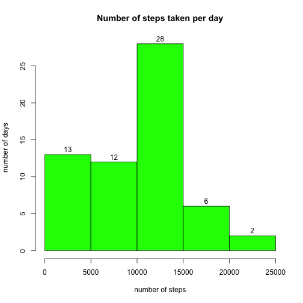
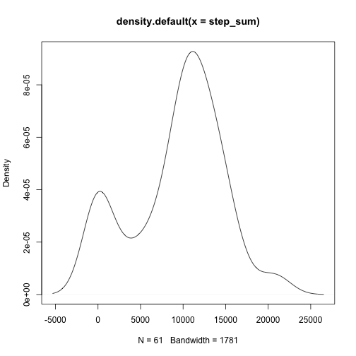
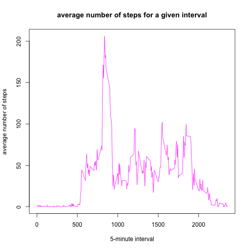
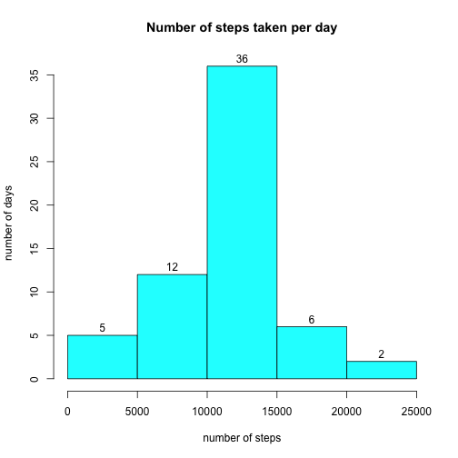
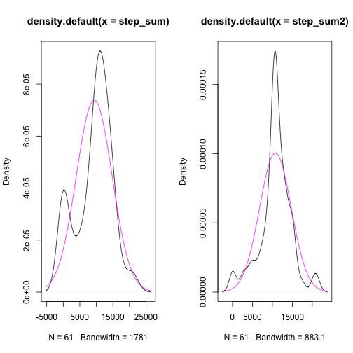
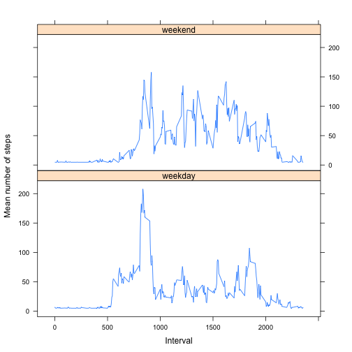

Reproducible Research Peer Assessment 1
========================================================

## *Loading and pre-processing the data*

The code below loads the data and transforms the *date* variable into POSIX.

```r
require(lubridate)
```

```
## Loading required package: lubridate
```

```r
activity <- read.table(file = "./data/activity.csv",
                        header=TRUE, 
                        sep=",")
activity$date <- ymd(activity$date)
```

## *What is mean total number of steps taken per day?*

A histogram of the total number of steps per day is presented below:


```r
step_sum <- tapply(activity$steps, activity$date, sum, na.rm=TRUE)
hist(step_sum, 
     xlab="number of steps", 
     ylab="number of days", 
     col="green", 
     main="Number of steps taken per day",
     labels=TRUE)
```

 

The mean of the total number of steps taken per day amounts to:


```r
mean(step_sum, na.rm=TRUE)
```

```
## [1] 9354.23
```

The median is:


```r
median(step_sum, na.rm=TRUE)
```

```
## [1] 10395
```

```r
plot(density(step_sum))
```

 

## *What is the average daily activity pattern?*

The figure below presents a time series plot of the 5-minute interval (x-axis) and the average number of steps taken, averaged across all days (y-axis)


```r
x_lbls <- activity[activity$date == ymd("2012-10-01"),3]
stepsPerInterval <- tapply(activity$steps,
                          activity$interval,
                          mean,
                          na.rm=TRUE)
plot(x=x_lbls,
     y=stepsPerInterval,
     main="average number of steps for a given interval",
     xlab="5-minute interval",
     ylab="average number of steps",
     type="l",
     col="magenta")
```

 

The following interval had the largest number of steps averaged over all days


```r
activity$interval[max(stepsPerInterval)]
```

```
## [1] 1705
```

## *Imputing missing values*

The dataset contains some missing values. These missing values will be imputed with the use of the following procedure:

* The *daily mean* will be taken for each missing number of steps
* If there is no data for a given day (and the mean cannot be calculated), the mean number of steps for all days will be taken

The following code loads the dataset again and converts date to POSIX


```r
setwd("/Users/Jarek/RDir/Coursera/Reproducible Research/Project 1")
require(lubridate)
activity2 <- read.table(file = "./data/activity.csv",
           header=TRUE, 
           sep=",")
activity2$date <- ymd(activity2$date)
```

This piece of code imputes the missing values


```r
activity2$date2 <- yday(activity2$date) - 274
dailyMean <- with(activity2, tapply(steps, date2, mean, na.rm=TRUE))
activity2$dailyMean <- as.numeric(dailyMean[activity2$date2])
globalMean <- mean(activity2$steps, na.rm=TRUE)
activity2$dailyMean[is.nan(activity2$dailyMean)] <- globalMean
activity2 <- within(activity2, steps <- ifelse (is.na(steps), dailyMean, steps))
write.table(activity2, file="./data/activity2.csv")
```

A histogram of the total number of steps per day (including the imputed values) is presented below:


```r
step_sum2 <- tapply(activity2$steps, activity2$date, sum, na.rm=TRUE)
hist(step_sum2, 
     xlab="number of steps", 
     ylab="number of days", 
     col="cyan", 
     main="Number of steps taken per day",
     labels=TRUE)
```

 

The mean of the total number of steps taken per day (including imputed values) amounts to


```r
mean(step_sum2, na.rm=TRUE)
```

```
## [1] 10766.19
```

The median is:


```r
median(step_sum2, na.rm=TRUE)
```

```
## [1] 10766.19
```

### The influence of the imputed values on the dataset

Imputing the missing values has changed the mean and the median of the sum of steps per day -- the mean equals the median. Moreover, both figures are higher for the dataset with imputed values.

Moreover, the probability density for the new dataset is more 'symmetrical' than for the initial dataset. There are also many more days whose sum of steps is concentrated around the mean:


```r
par(mfrow=c(1,2))
plot(density(step_sum))
x <- step_sum
curve(dnorm(x, mean(step_sum), sd(step_sum)), col="magenta", add=T)
x <- step_sum2
plot(density(step_sum2))
curve(dnorm(x, mean(step_sum2), sd(step_sum2)), col="magenta", add=T)
```

 

## *Are there differences in activity patterns between weekdays and weekends?*

The code below generates the required weekday / weekend variable (named weekPart).


```r
weekPart <- weekdays(activity2$date)
activity2 <- within(activity2, 
                    weekPart <- ifelse(
                          weekPart == "Monday" | 
                                weekPart == "Tuesday" | 
                                weekPart == "Wednesday" | 
                                weekPart == "Thursday" | 
                                weekPart == "Friday", 
                          "weekday", 
                          "weekend"))
activity2 <- activity2[,-c(4)]
```

This part of code splits the dataset along the weekPart variable


```r
splitWeek <- split(activity2, activity2$weekPart)
sw1 <- as.data.frame(splitWeek[1])
sw2 <- as.data.frame(splitWeek[2])
meanWeekday <- tapply(sw1$weekday.steps, sw1$weekday.interval, mean, na.rm=TRUE)
meanWeekend <- tapply(sw2$weekend.steps, sw2$weekend.interval, mean, na.rm=TRUE)
meanWeekday <- as.data.frame(meanWeekday)
meanWeekend <- as.data.frame(meanWeekend)
meanWeekday$weekPart <- as.factor("weekday")
meanWeekend$weekPart <- as.factor("weekend")
colnames(meanWeekday) <- c("mean", "weekPart")
colnames(meanWeekend) <- c("mean", "weekPart")
meanCombined <- rbind(meanWeekday, meanWeekend)
meanCombined$interval <- as.numeric(row.names(meanWeekday))
```

Finally, the code below plots two time series: the 5-minute interval (x-axis) and the average number of steps taken, averaged across all weekday days or weekend days (y-axis)

```r
require(lattice)
```

```
## Loading required package: lattice
```

```r
plottedDifference <- xyplot(mean ~ interval | weekPart, 
                  data = meanCombined, 
                  type = "l", layout=c(1,2), 
                  xlab="Interval",
                  ylab = "Mean number of steps")
plot(plottedDifference)
```

 

The mean number of steps taken on weekdays and standard deviation are 

```r
stepsWeekday <- tapply(sw1$weekday.steps, sw1$weekday.date, sum, na.rm=TRUE)
mean(stepsWeekday)
```

```
## [1] 10255.85
```

```r
sd(stepsWeekday)
```

```
## [1] 4364.075
```

And at weekends

```r
stepsWeekend <- tapply(sw2$weekend.steps, sw2$weekend.date, sum, na.rm=TRUE)
mean(stepsWeekend)
```

```
## [1] 12201.52
```

```r
sd(stepsWeekend)
```

```
## [1] 2082.903
```

As we can see, subjects took more steps on average at weekends. The difference in standard deviation suggests that the number of steps at different parts of day (intervals) was also more balanced at weekends. The time series plot for weekends also suggests that the number of steps was the highest around mornings (i.e. intervals ~700-900).

